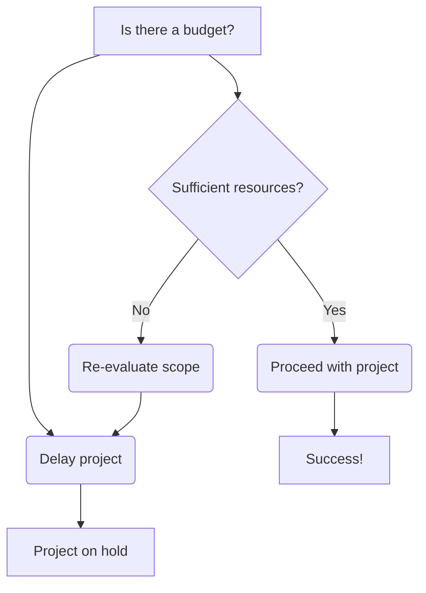

###### *Sep 6 - 8,9,10?, 0223*
![[floes.png]]The party must travel 50 miles across [[The Floes]] to reach [[Shimmer Grove]].

#### Leg 1: Reach the river

###### Decision points:
- Hike south to get canoes, or directly southeast.
- Take the southern tributary or hike directly southeast
- 

Table:

| Roll | Day     | Night | Encounter | Roll | Day     | Night | Encounter |
| ---- | ------- | ----- | --------- | ---- | ------- | ----- | --------- |
| 1    | Thunder |       |           | 13   | Clouds  |       |           |
| 2    | Thunder |       |           | 14   | Thunder |       |           |
| 3    | Thunder |       |           | 15   | Rain    |       |           |
| 4    | Thunder |       |           | 16   | Rain    |       |           |
| 5    | Rain    |       |           | 17   | Rain    |       |           |
| 6    | Rain    |       |           | 19   | Sun     |       |           |
| 7    | Rain    |       |           | 19   | Sun     |       |           |
| 8    | Rain    |       |           | 20   | Sun     |       |           |
| 9    | Rain    |       |           | 21   | Sun     |       |           |
| 10   | Rain    |       |           | 22   | Sun     |       |           |
| 11   | Showers |       |           | 23   | Sun     |       |           |
| 12   | Showers |       |           | 24   | Sun     |       |           |

#### Leg 2: Climb the mountains

#### Leg 3: Descend into the grove